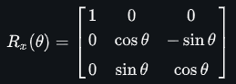
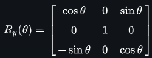
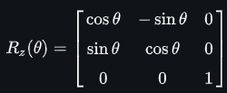
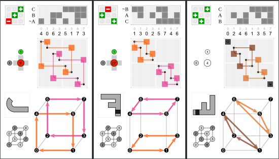
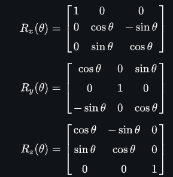
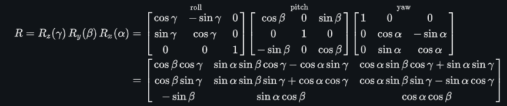

# Rotating 3D ASCII Cube in Pascal 🎮📦🧊➰

Um programa Pascal que renderiza um cubo 3D rotativo usando caracteres ASCII no console. Projeto demonstra conceitos de:
- **Geometria 3D**
- **Projeção perspectiva**
- **Rotação de objetos**
- **Double buffering** com `z-buffer`

## 🌐 Fundamentos Matemáticos

### Matrizes de Rotação 3D ([Fonte](https://en.wikipedia.org/wiki/Rotation_matrix))
([Inspiração👉](https://www.youtube.com/watch?v=p09i_hoFdd0&ab_channel=ServetGulnaroglu))
O cubo gira usando combinações de matrizes de rotação em 3 eixos:

#### 1. Rotação nos Eixos Individuais
| Eixo | Matriz | Implementação no Código |
|------|--------|-------------------------|
| **X** |  | `j*Cos(A)`, `k*Sin(A)` |
| **Y** |  | `i*Cos(B)`, `k*Sin(B)` |
| **Z** |  | `j*Cos(C)`, `i*Sin(C)` |

#### 2. Rotação Combinada (Euler Angles)
As funções `CalculateX/Y/Z` combinam as 3 rotações usando a ordem Z → Y → X:
```pascal
// Cálculo X combina rotações Y (B) e Z (C)
j*Sin(A)*Sin(B)*Cos(C) - k*Cos(A)*Sin(B)*Cos(C) + 
j*Cos(A)*Sin(C) + k*Sin(A)*Sin(C) + 
i*Cos(B)*Cos(C)
```

#### 3. Projeção Perspectiva
A coordenada 3D → 2D usa:
```
ooz = 1/z (inverso da profundidade)
xp = (x * K1 * ooz) + offset
yp = (y * K1 * ooz) * -1 (inverte eixo Y)
```


## 🧮 Implementação das Fórmulas
### Cálculo de Coordenadas 3D
```pascal
function CalculateX(i, j, k: Real): Real;
begin
  CalculateX := 
    j*Sin(A)*Sin(B)*Cos(C) - k*Cos(A)*Sin(B)*Cos(C) + // Rotação Y+Z
    j*Cos(A)*Sin(C) + k*Sin(A)*Sin(C) +                // Rotação X+Z
    i*Cos(B)*Cos(C);                                   // Componente principal X
end;
```

### Sistema de Coordenadas
| Componente | Variável | Função |
|------------|----------|--------|
| Profundidade | `z` | Define escala da projeção |
| Offset Horizontal | `horizontalOffset` | Centraliza no terminal |
| Escala | `K1` | Controla "campo de visão" |

## 🖼️ Espaço para Imagens (Adicione 3 screenshots)
1. **Diagrama de Rotação**  
   

2. **Equações Completas**  
   

3. **Projeção 3D→2D**  
   

## 🔄 Fluxo de Transformações
1. **Rotação 3D**  
   `(i,j,k) → (x,y,z) via matrizes`
2. **Projeção Perspectiva**  
   `(x,y,z) → (xp,yp) via ooz`
3. **Oclusão**  
   `zBuffer resolve sobreposições`

## 📚 Recursos Adicionais
- [Artigo sobre Matrizes de Rotação](https://en.wikipedia.org/wiki/Rotation_matrix)
- [Sistemas de Coordenadas 3D](https://en.wikipedia.org/wiki/3D_projection)
- [Depth Buffering](https://en.wikipedia.org/wiki/Z-buffering)


## 📋 Estrutura Principal

### Variáveis Globais
```pascal
var
  A, B, C: Real;        // Ângulos de rotação nos eixos X/Y/Z
  cubeWidth: Real;       // Tamanho do cubo (metade da aresta)
  width, height: Integer;// Dimensões do terminal
  zBuffer: array of Real;// Buffer de profundidade
  buffer: array of Char; // Buffer de renderização
  K1: Real;              // Constante de escalonamento perspectiva
```

### 🔑 Componentes Chave

1. **Inicialização**
   - `InitializeVariables`: Configura parâmetros iniciais
   - `InitializeBuffers`: Prepara buffers com caracteres de fundo ('.')

2. **Cálculos 3D**
   ```pascal
   function CalculateX/Y/Z(i,j,k: Real): Real
   ```
   - Fórmulas de rotação 3D usando matrizes de rotação
   - Combinação de rotações nos 3 eixos (A,B,C)

3. **Projeção Perspectiva**
   ```pascal
   ooz := 1 / z;  // "One over z" para efeito perspectiva
   xp := ... + K1 * ooz * x;  // Projeção X
   yp := ... - K1 * ooz * y;  // Projeção Y (eixo invertido)
   ```

4. **Renderização**
   - `CalculateForSurface`: Projeta pontos 3D → 2D com:
     - Verificação de profundidade (`zBuffer`)
     - Atribuição de caracteres diferentes por face (`@`, `$`, `~`, etc.)
   - `RenderFrame`: Desenha todas as 6 faces do cubo

## 🎮 Como Funciona
1. **Loop Principal**
   ```pascal
   repeat
     RenderFrame;
     Delay(0);  // ~60 FPS
   until False;
   ```
2. **Animação**
   - Incrementa ângulos de rotação a cada frame:
   ```pascal
   A += 0.05; B += 0.05; C += 0.01;
   ```

3. **Otimizações**
   - `zBuffer` evita sobreposição incorreta de pixels
   - Buffer de caracteres para renderização rápida

## 🛠️ Personalização
```pascal
// Experimente alterar:
cubeWidth := 15;       // Cubo maior
width := 120;          // Terminal mais largo
backgroundASCIICode := ' ';  // Fundo vazio
K1 := 60;              // Perspectiva mais extrema
```

## 📦 Dependências
- Compilador Pascal (Free Pascal/Turbo Pascal)
- Unit `crt` para manipulação de console

## 🚀 Como Executar
```bash
fpc rotating_cube.pas && ./rotating_cube
```

## 🔍 Detalhes Técnicos Interessantes
- **ASCII Art 3D**: Uso criativo de caracteres para representação 3D
- **Depth Buffering**: Técnica profissional usada em jogos 3D
- **Matrizes de Rotação**: Implementação manual sem bibliotecas gráficas
- **Otimização de Performance**: Renderização direta no console

## 📌 Possíveis Melhorias
- [x] Adicionar controle de FPS preciso
- [ ] Implementar input do usuário
- [ ] Adicionar cores (ANSI escape codes)
- [ ] Sistema de partículas rotativas


*Projeto educativo para entender fundamentos de gráficos 3D!* 🎓
